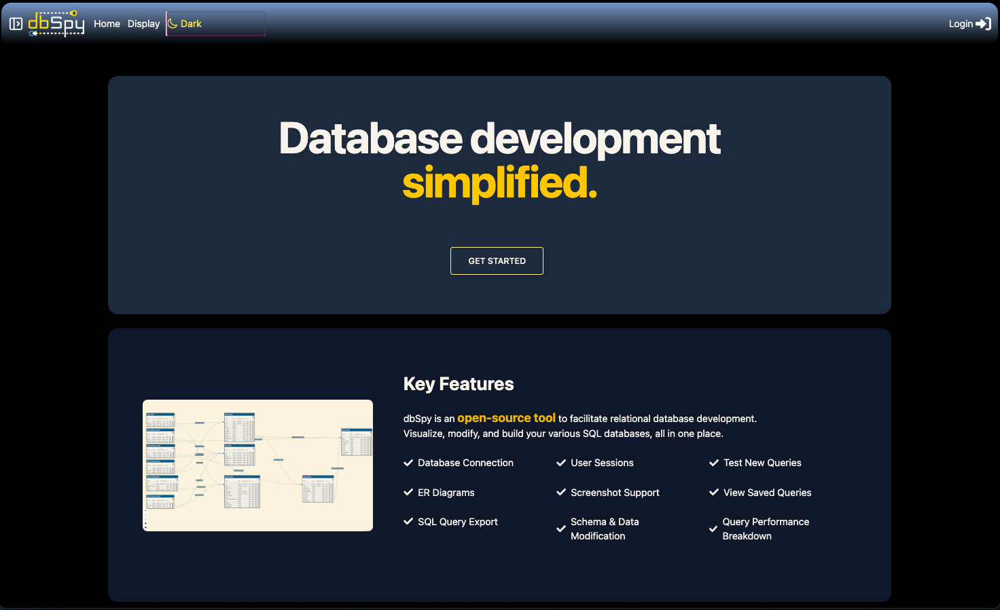
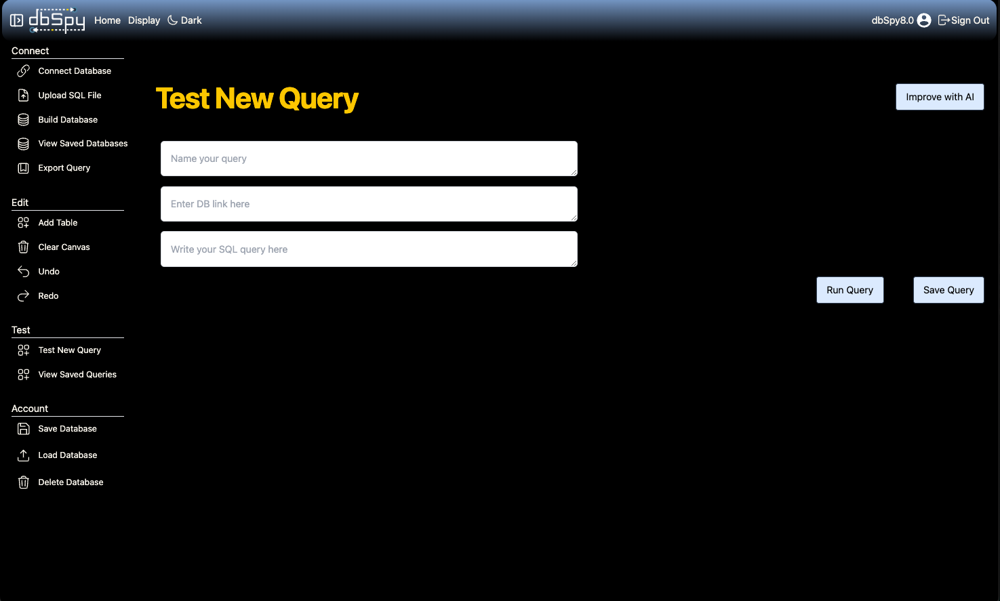
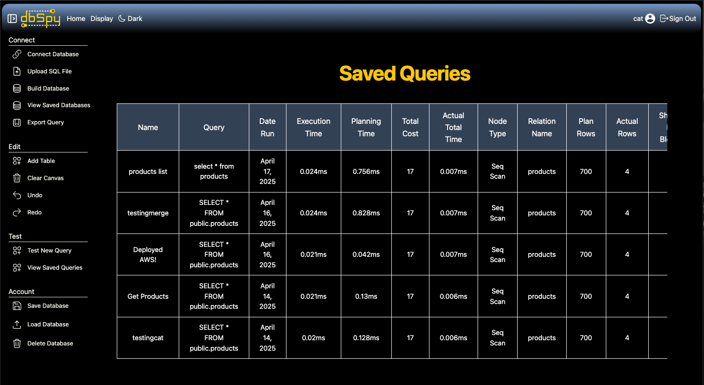

<div align="center">

<a href="https://makeapullrequest.com"></a>
<a href="https://img.shields.io/badge/version-1.0.1-blue"></a>


</div>

<div align="center">
  


</div>

<h1 align="center">Visualize, modify, and build your database with dbSpy!</h1>
<p align="center">An open-source data modeling tool to facilitate relational database development</p>

### 🚀 dbSpy v8.0 ✨ New Features

### 🔍 Test New Query Page - a modern querying interface

- Run SQL queries against PostgreSQL or MySQL DBs
- Live results + metadata: execution time, query name, timestamp
- Zustand-powered state management
- Input validation and error handling
- Component-level Jest + ReactTestLibrary tests

### 💾 View Saved Queries Page

- Access previously saved queries per user
- Sortable, styled tables with TypeScript typing
- Track query performance across data models

### 🎨 UI / UX Enhancements

- TailwindCSS redesign: colors, layout, interactions
- Responsive and fully supported dark/light mode
- Logo animation integrated in navbar
- Sidebar and tab layout fixes

### 🛠 Functional Fixes

- Resolved layout shift bugs
- Optimized backend response handling
- OAuth (GitHub + local login)

### 📈 Opportunities for Continued Development

- Extend Test Query feature to additional DB types (e.g. Oracle)
- Persist database sessions across routes
- Integrate LLMs to suggest efficient queries and schema improvements
- Add OAuth support for Microsoft accounts
- Add support for NoSQL (MongoDB) and graph databases
- Expand UI testing coverage

---

### dbSpy v8.0 updates

- Full widescreen UI with a dropdown menu for more workspace
- Enhanced Save, Load, and Delete features that support filenames for saving schema and data
- Proper deletion of dependent elements across tables
- Algorithm to highlight edges connected to the selected table
- Fixed rendering and deletion issues with elements
- Support for connecting to remote databases (PostgreSQL, MySQL, Microsoft SQL, Oracle SQL)
- Ability to upload SQL files and render ER diagrams for the provided SQL dump
- Interface for modifying tables and creating new ones, with changes reflected in the database via generated queries
- Canvas to create databases and ER diagrams from scratch.

---

### 🔑 Key Features

1. **Database Uploads:** Connect to remote SQL database or upload local SQL files

2. **ER Diagram Visuals:** Visualize the entity relationship diagram of a database with dynamic handle placement

3. **Table Relationship Visuals** Relationships of individual tables are easily identified when clicking on a table

4. **Schema Modification:** Toggle between Schema and Data easily with a click of a button

5. **Data/Schema Modification:** Easily modify a database's schema or data through a simple UI

6. **Guided Database Building:** Create a new database from scratch using entity relationship diagrams to ensure the integrity of the database

7. **Database Undo/Redo:** Provides a history of edits for easier backtracking

8. **Query Generator:** Query generator generates executable SQL queries

9. **User Sessions:** Sign up/Log in securely with either Google/Github OAuth or JWTs/Bcrypt

10. **Save/Load:** Store and reload past database sessions through your user accoun

11. **Dark Mode:** Visual settings to provide a more comfortable viewing experience in low-light environements

12. **Live Querying and Save Queries** Test SQL queries and also save them to track and analyze query performance across data models (<span style="color:green"><strong>dbSpy V8.0</strong></span>)

## 

## 

## 

### 🛠 Getting started

You will need your own MySQL database for backend functions.

- Fork and clone this repo
- Add a db_schemas folder in server directory
- Add a .env file to the root directory with the information below:

```bash
# production environment variables
USER_DB_URL = <MySQL url for storing user data>
USER_DB_USER = <user string from USER_DB_URL>
USER_DB_PW = <password string from USER_DB_URL>
TOKEN_KEY = <any string>

# testing environment variables
## encoded SSL data required for GitHub Actions
SSL_KEY = <base64 encoded SSL key (see SSL Configuration)>
SSL_CERT = <base64 encoded SSL cert>
## MySQL and Postgres databases to test remote connection functionality
MYSQL_TEST_URL = <MySQL url for a test database>
MYSQL_TEST_USERNAME = <user string from MYSQL_TEST_URL>
MYSQL_TEST_PW = <password string from MYSQL_TEST_URL>
PG_TEST_URL = <PostgreSQL url for a test database>
PG_TEST_USERNAME = <user string from PG_TEST_URL>
PG_TEST_PW = <password string from PG_TEST_URL>
## test user with saved schema to test save/load functionality
TEST_USER_EMAIL = <email string>
TEST_USER_PW = <password string>

GOOGLE_OAUTH_CLIENT_ID = <Google Oauth client id>
GOOGLE_OAUTH_CLIENT_SECRET= <Google Oauth client id>
GOOGLE_OAUTH_REDIRECT_URI = 'http://localhost:8080/display'

GITHUB_OAUTH_CLIENT_ID = <Github Oauth client id>
GITHUB_OAUTH_CLIENT_SECRET= <Github Oauth client id>
GITHUB_OAUTH_REDIRECT_URI = 'http://localhost:8080/display'

```

- Run the following below:

```bash
$ npm install
```

- Execute the following command to populate your mySql database with a users table:

```bash
$ npm run seed
```

- Run the project in development mode:

```bash
$ npm run dev
```

---

### SSL Configuration

To connect with the SQL database, we must create and configure SSL certificates.

### macOS

1. Install mkcert; you can learn more about mkcert [here](https://github.com/FiloSottile/mkcert)

```bash
npm install -g mkcert
```

2. Run the following script

```bash
npm run cert:mac
```

### Linux

1. Check mkcert is up to date (v1.5.1 as of publishing)

```bash
mkcert --version
```

2. Run the following script

```bash
npm run cert:linux
```

---

# How to Use

### Connecting to an existing database

1. Click on the "Connect Database" button under the Action section on the left side of the page. This will open a sidebar on the right side of the page.
2. Select the database type from the dropdown.
3. Input your database URI information OR database connection credentials and click on "Connect".
4. Once the connection to your database is established, the canvas will render and generate the tables and their relationships.
   - OracleSQL requires the download of the OCI - [here](https://www.oracle.com/cloud/free/)

### Uploading your database's SQL file

1. Locate and click on the "Upload SQL File" button under the Action section on the left side of the page. This will open a dialog box for you to select the SQL file you wish to upload.
2. Once the file uploads, the canvas will render and generate the tables and their relationships.

### Starting an ER diagram from scratch

1. Locate and click on the "Build Database" button under the Action section on the left side of the page. This will render the canvas for you to create your database schema.
2. Click on "Add Table" to name the first table and start building your database.

## Adding column(s) to a SCHEMA table or row(s) to a DATA table

1. To add a new column/row in a table, click on the add/plus icon on the top right of the table node.
2. This will render a new column/row in the table in edit mode.
3. Add in the data you would like in each column/row.
4. Click on the confirm icon to save the column/row.
5. The changes made in DATA table will be updated in your database.
6. Click on the cancel icon to cancel the addition.

   

   

### Editing an existing row of a DATA table

1. Click on the edit icon of the specific column that you want to edit.
2. You can make changes to column fields based on the selections provided.
3. Click on the save icon to keep your changes.
4. Click on the cancel icon to cancel your changes.

### Deleting a column to a SCHEMA table or row of a DATA table

1. Click on the delete icon of the specific column that you want to delete.
2. Click on the confirm icon to delete the column.
3. Click on the cancel icon to cancel the deletion.

## 

### Adding a foreign key reference to a column

1. While editing a column, if setting Foreign Key (FK) to "true", the Foreign Key Reference sidebar will appear on the right side of the screen.
2. In the Foreign Key Reference sidebar, use the displayed dropdowns to create references between tables.
3. Click save or cancel to proceed.
4. Click on the save icon to keep your changes or click on the cancel icon to cancel your changes.

### Adding a table to a database

1. When on the display page, click the 'Add Table' icon after you have either connected to a database or clicked 'Build Database'.
2. Fill in the required information about the first column of your table along with a name.
3. If you would like to include additional columns, click the 'Add Column' button in the top right corner.
4. Click confirm to create your table.

### Deleting a table from a database

1. After you have either connected to a database or started a new database, the 'Delete Table' icon will appear on the left side of the display page
2. This will open a pop out with a list of tables from the database.
3. Select which table that you would like to have removed, and confirm to have it deleted.

### Navigating the canvas

1. Located on the bottom left corner of the canvas, you will find the canvas control panel.
   - Zoom On [+] - this button zooms into the canvas.
   - Zoom Out [-] - this button zooms out of the canvas.
   - Fit View [[]] - this button zooms to fit all the tables in focus.
   - Toggle Interactivity [lock] - this button toggles on and off all table and column interactivity.
   - Screenshot [camera] - this button saves a .png file of the current canvas view.

---

### Future contributions and requests

- If you'd like to contribute, please find a list of possible contributions [here](Contributors.md)
- If you have any requests, please submit an appropriately tagged GitHub issue
- PRs are welcome otherwise

---

### Credits/Contributors

- Yihe Liu • [LinkedIn](https://www.linkedin.com/in/yiheliu) • [Github](https://github.com/SparrowGecko)
- Emma Vargas • [LinkedIn](https://www.linkedin.com/in/emmavargas/) • [Github](https://github.com/emma-vargas)
- Vicky Yue • [LinkedIn](https://www.linkedin.com/in/vickyue/) • [Github](https://github.com/vyue013)
- Roshumba Llewellyn • [LinkedIn](https://www.linkedin.com/in/roshumballewellyn/) • [Github](https://github.com/roshumba)
- Revathy Venkataraman • [LinkedIn](https://www.linkedin.com/in/revavenk/) • [Github](https://github.com/reva2024)
- David Jones • [LinkedIn](http://www.linkedin.com/in/davidjonesswe/) • [Github](https://github.com/david-jones-git)
- John Ruiz • [LinkedIn](https://www.linkedin.com/in/john-ruiz-profile/) • [Github](https://github.com/johnruiz17)
- Minh Chang • [LinkedIn](https://www.linkedin.com/in/minh-chang/) • [Github](https://github.com/miha-cha)
- Darius Okafor • [LinkedIn](https://www.linkedin.com/in/dariusokafor/) • [Github](https://github.com/DE7741)
- Parwinder Singh • [LinkedIn](http://www.linkedin.com/in/singh-parwinder/) • [Github](https://github.com/PintaAE86)
- Yichung Chiu • [LinkedIn](https://www.linkedin.com/in/yichung-chiu-b14a94272/) • [Github](https://github.com/ychiu5896)
- Joseph Tejeda • [LinkedIn](https://www.linkedin.com/in/atxjtejeda/) • [Github](https://github.com/JosephTejeda)
- Stephen Havig • [LinkedIn](https://www.linkedin.com/in/stephen-havig-199340145/) • [Github](https://github.com/Stephen-Havig)
- Das Kang • [LinkedIn](https://www.linkedin.com/in/das-kang/) • [Github](https://github.com/dahae0309)
- Alexander Tu • [LinkedIn](https://www.linkedin.com/in/atu816/) • [Github](http://github.com/atu816)
- Michael Costello • [LinkedIn](https://www.linkedin.com/in/mcostello-swe/) • [Github](https://github.com/neighbor-peace)
- Steven Geiger • [LinkedIn](https://www.linkedin.com/in/sgeiger9/) • [Github](https://github.com/geistnine)
- Yufa Li • [LinkedIn](https://www.linkedin.com/in/yufa-li/) • [Github](https://github.com/01001101CK)
- Angel Giron • [LinkedIn](https://www.linkedin.com/in/acgiron/) • [Github](https://github.com/g94angel)
- John Paul Adigwu • [LinkedIn](https://www.linkedin.com/in/johnpaul-adigwu/) • [Github](https://github.com/engineerous)
- Kevin Park-Lee • [LinkedIn](https://www.linkedin.com/in/kevin38424/) • [Github](https://github.com/kevin38424)
- Tarik Mokhtech • [LinkedIn](http://linkedin.com/in/tarik-mokhtech) • [Github](https://github.com/MockTech)
- Brett Guidry • [LinkedIn](https://www.linkedin.com/in/brett-guidry504/) • [Github](https://github.com/BrettGuidryDev)
- Emil Mebasser• [LinkedIn](https://www.linkedin.com/in/emil-mebasser-a1a2a815/) • [Github](https://github.com/ejmebasser)
- Mimi Le • [LinkedIn](https://www.linkedin.com/in/my-le-a94575226/) • [Github](https://github.com/kawaiiyummy14)
- Samson Lam • [LinkedIn](https://www.linkedin.com/in/samson-lam-455846219/) • [Github](https://github.com/sflam2013)
- Adrian Reczek • [LinkedIn](https://www.linkedin.com/in/adrian-reczek/) • [Github](https://github.com/adziu1234)
- Anthony Al-Rifai • [LinkedIn](https://www.linkedin.com/in/anthony-al-rifai-31677a100/) • [Github](https://github.com/AnthonyAl-Rifai)
- Kevin Wang • [LinkedIn](https://www.linkedin.com/in/kevin-w-b841b13/) • [Github](https://github.com/kwang929)
- Kris Magat • [LinkedIn](https://www.linkedin.com/in/kmag/) • [Github](https://github.com/KrisMagat)
- Santiago Gil Maya • [LinkedIn](https://www.linkedin.com/in/santiago-gil-929721121/) • [Github](https://github.com/santiago-gil)
- Donald Macak • [LinkedIn](https://www.linkedin.com/in/donald-macak-7b6592279/) • [Github](https://github.com/Donald-Macak)
- Matthew Cummings • [LinkedIn](https://www.linkedin.com/in/matthew-cummings-a25179113/) • [Github](https://github.com/mcummings190)
- Stanley Ho • [LinkedIn](https://www.linkedin.com/in/stanho347/) • [Github](https://github.com/Stanley7c114)
- Matthew Jones • [LinkedIn](https://www.linkedin.com/in/matthew-jones-05a27840/) • [Github](https://github.com/TagiMagi)

---

### License

dbSpy is developed under the MIT license.
